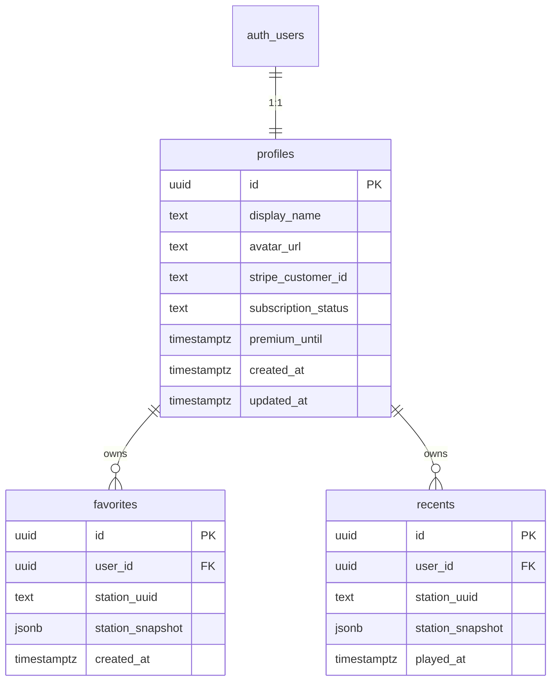

# Data Model: The Dome Radio PWA

**Date**: 2026-07-09  
**Source**: [spec.md](./spec.md), [research.md](./research.md)

## Overview

Authoritative user data lives in Supabase Postgres with Row Level Security. The client keeps a `localStorage` / in-memory cache (`dome:*`) for offline reads and guest sessions. Station catalog entities are **not** owned by The Dome — they come from Radio Browser and are snapshotted when favorited.



---

## Entities

### Listener (Guest)

- **Identity**: No `auth.users` row (or anonymous session if we enable anonymous auth later — default v1: no account).
- **Capabilities**: Browse, stream, see ads, cast to Chromecast/AirPlay when available, MediaSession remotes.
- **Storage**: Device-local only (`localStorage`). Favorites are not account-backed (FR-006).

### Registered User → `auth.users` + `profiles`

| Field | Type | Rules |
|-------|------|--------|
| `id` | uuid PK | Equals `auth.users.id` |
| `display_name` | text | Optional; default from email local-part |
| `avatar_url` | text | Optional |
| `stripe_customer_id` | text | Nullable; set by webhook/checkout |
| `subscription_status` | text | `free` \| `active` \| `canceled` \| `past_due` |
| `premium_until` | timestamptz | Nullable; grace after cancel until period end |
| `created_at` / `updated_at` | timestamptz | Server-managed |

**Paid entitlement (derived)**:

```text
isPremium = subscription_status == 'active'
         OR (premium_until IS NOT NULL AND premium_until > now())
```

- Readable by the owning user via RLS.
- **Writable** for payment fields only by service role (Netlify webhook), never by the anon/authenticated client.

### Station (external)

Not stored as a first-class table. Identified by Radio Browser `stationuuid`. Snapshot fields used in favorites/recents:

| Snapshot key | Purpose |
|--------------|---------|
| `name` | Display |
| `favicon` | Icon (always stored/displayed as `https://` when the source was `http://` or protocol-relative — see NFR-SEC-001) |
| `url` / `url_resolved` | Stream (playback tries `https://` first via `streamPlayCandidates`; may fall back to original `http://` — see NFR-SEC-001) |
| `country` / `countrycode` | Atlas UI |
| `tags` | Genre chips |
| `bitrate` | Optional meta |

### Favorite → `favorites`

| Field | Type | Rules |
|-------|------|--------|
| `id` | uuid PK | Default `gen_random_uuid()` |
| `user_id` | uuid FK | → `profiles.id` |
| `station_uuid` | text | Radio Browser id |
| `station_snapshot` | jsonb | Denormalized display/stream fields |
| `created_at` | timestamptz | |

**Constraints**: `UNIQUE (user_id, station_uuid)`.  
**RLS**: `user_id = auth.uid()` for SELECT/INSERT/UPDATE/DELETE.  
**Validation**: `station_uuid` non-empty; snapshot must include at least `name` and a stream URL when available.

### Recent → `recents` (prototype parity; supports sync)

| Field | Type | Rules |
|-------|------|--------|
| `id` | uuid PK | |
| `user_id` | uuid FK | |
| `station_uuid` | text | |
| `station_snapshot` | jsonb | |
| `played_at` | timestamptz | Updated on each play |

**Constraints**: Prefer upsert on `(user_id, station_uuid)`; keep last **12** per user (app logic or trigger deleting older rows).  
**RLS**: Same as favorites.

### Ad Impression / Ad Break

Not persisted in v1 (no analytics warehouse). Client decides visibility from `isPremium` and free-tier placement rules. Future: optional event log — out of scope.

### Cast Session

Not a server entity. Client-only session state for Google Cast and/or AirPlay/remote playback:

| Field (client) | Meaning |
|----------------|---------|
| `provider` | `cast` \| `airplay` \| `none` |
| `state` | `idle` \| `connecting` \| `connected` \| `error` |
| `deviceName` | Display label when known |
| `station_uuid` | Station currently loaded on the receiver |

MediaSession remains separate (local device remotes). See research Decision 5.

### Appearance Preference

Device-local (`localStorage` / `prefers-color-scheme`) per prototype. Not synced in v1 unless cheap to add to `profiles` later.

---

## State transitions

### Subscription status

```text
free ──checkout.completed──► active
active ──cancel at period end──► canceled (premium_until = period_end)
active ──payment fail──► past_due
past_due ──payment succeeds──► active
past_due / canceled ──period ended──► free (premium_until null or expired)
```

Webhook must be **idempotent** (Stripe event id dedupe table optional; at minimum upsert by `stripe_customer_id` / subscription id).

### Auth session

```text
guest ──signUp/signIn──► registered (free)
registered ──signOut──► guest
registered(free) ──subscribe──► registered(paid)
registered(paid) ──entitlement ends──► registered(free)
```

---

## Sync rules

| Event | Behavior |
|-------|----------|
| Sign-in | Pull favorites + recents + profile; **server wins** on conflicts; refresh local cache |
| Favorite toggle (signed in) | Write-through to Supabase; update local cache |
| Play (signed in) | Upsert recent; trim to 12 |
| Offline | Reads from local cache; queue writes optional in v1 — if no queue, show “will sync when online” and retry on reconnect |
| Guest → register | Prompt; optionally import local favorite UUIDs into account once |

---

## RLS summary

| Table | SELECT | INSERT/UPDATE/DELETE | Payment columns |
|-------|--------|---------------------|-----------------|
| `profiles` | Own row | Own row for `display_name`, `avatar_url` only | Service role only |
| `favorites` | Own rows | Own rows | N/A |
| `recents` | Own rows | Own rows | N/A |

Trigger: on `auth.users` insert → create `profiles` row with `subscription_status = 'free'`.

---

## Local cache keys (client)

Preserve prototype prefix `dome:` where practical:

| Key | Content |
|-----|---------|
| `dome:session` / Supabase session | Managed by Supabase client |
| `dome:favs` | Cached favorites array |
| `dome:recents` | Cached recents |
| `dome:profile` | Cached profile including premium flags |
| `dome:theme` | Appearance |

IndexedDB `dome-studio` remains for frozen Creator prototype only — not part of listener sync.
